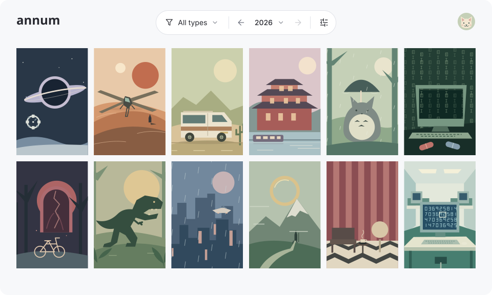

<h1 align="center">annum</h1>

<p align="center">
  <strong>
    Visualize Your Simkl History
  </strong>
</p>

<p align="center">
  Display your watched movies, shows and anime in a poster grid, year by year. Powered by: <a href="https://simkl.com">Simkl</a>
</p>

<h2 align="center">
  <a href="https://www.annum.app">Visit annum.app</a>
</h2>

This website was created by [LekoArts](https://www.lekoarts.de?utm_source=annum_readme) as a christmas project to try out SvelteKit. LekoArts loves watching movies and shows ⸺ so why not have a great overview?



## Development

This [SvelteKit](https://kit.svelte.dev/) project was bootstrapped with [`create-svelte`](https://github.com/sveltejs/kit/tree/main/packages/create-svelte).

### Prerequisites

1. [Install Node.js](https://nodejs.org/en/learn/getting-started/how-to-install-nodejs) 20 or later
1. [Install pnpm](https://pnpm.io/installation)

### Repository setup

1. Install dependencies

    ```shell
    pnpm install
    ```

1. Create a duplicate of `.env.example` and name it `.env`

1. Retrieve the necessary secrets:

    1. `PUBLIC_SIMKL_CLIENT_ID`: Login to [Simkl](https://simkl.com/settings/developer/) and create a new application of type **browser sign-in + app callback**. Add `http://localhost:5173/api/auth/callback/simkl` as a registered redirect URL (Simkl requires an exact match, so a different dev port needs its own callback URL). Copy the **Client ID** over to the `.env` file. Simkl's browser sign-in apps are public clients, so there is no client secret — the app authenticates with PKCE.

    1. `PRIVATE_BETTER_AUTH_SECRET`: Generate a random string which is used to encrypt tokens. Run `openssl rand -base64 32` in your terminal and copy the value over to the `.env` file.

### Commands

Starting the development server:

```shell
pnpm dev
```

Create a production build locally:

```shell
pnpm build
```

Preview that build locally with `pnpm preview`.

## How it works

**Stack:** [SvelteKit](https://svelte.dev/docs/kit) 3 with Svelte 5 runes, TypeScript in strict mode, Tailwind CSS v4 through `@tailwindcss/vite`, [Better Auth](https://better-auth.com) for sessions, and `@sveltejs/adapter-netlify` for deploys.

### Authentication

Better Auth's `genericOAuth` plugin registers Simkl as a first-class social provider (`authClient.signIn.social({ provider: 'simkl' })`), so the callback lives at `/api/auth/callback/simkl` — that exact URL has to be registered with Simkl. The flow is Simkl's AUTH V2 authorization code with mandatory PKCE `S256` and no client secret, requesting only `media:read`.

Sessions are stateless: the session and account (token) cookies are encrypted JWTs and nothing is stored server-side. Simkl access tokens last 7 days, refresh tokens 180 days. Server code gets a token through `getSimklAccessToken()` (`auth.api.getAccessToken` with the account cookie), which refreshes an expired token and rewrites the cookie.

On Netlify deploy previews the origin differs from the registered one, so `oAuthProxy` hands the callback to the production deployment and sends the user back to the preview.

### Sync

`/api/simkl/sync` follows the two phases Simkl documents:

- **First sync:** `/sync/all-items` for movies, shows and anime sequentially, then `/sync/activities` to store the bootstrap `activities.all`.
- **Later syncs:** `/sync/activities` first, stopping when `activities.all` has not moved. Otherwise one multi-type `/sync/all-items?date_from=<saved activities.all>` delta is **merged** into the cache, never replacing it.
- **Deletions** never appear in a delta: when a domain's `removed_from_list` moves, the endpoint refetches `extended=simkl_ids_only` and diffs the ids.

Shows and anime are pulled with `extended=full&episode_watched_at=yes&include_all_episodes=original`; movies carry no episodes and are pulled plain. `original` is the lighter of `include_all_episodes`' two values — `yes` adds a row for every episode of every completed show, and those synthesized rows only ever carry the show's last-watched time, which `last_watched_at` already provides. Only the episodes the user actually recorded come back, and those are what place a show in each year it was watched.

Simkl asks for sync to be driven by user-visible events, not a timer. The dashboard therefore checks on mount, but only when the cache is older than `SYNC_INTERVAL_MS` (15 minutes) or belongs to another account; the check is claimed through `navigator.locks` (`annum-sync`) so a second tab skips while one is already syncing. Browsers without Web Locks fall back to a 30-second `localStorage` lease, still so a second tab skips. "Refresh now" in the settings popover forces a check regardless.

Every request sends `client_id`, `app-name` and `app-version` plus a bearer token for user data. Per-second `rate_limit` 429s and transient 5xx retry with exponential backoff, and every retry logs why it is waiting and for how long; daily-quota 429s (`user_limit_exceeded`/`app_limit_exceeded`) and `412` are surfaced instead. A failed sync shows Simkl's own reason — e.g. the daily quota's "try again in N seconds" — in the dashboard status chip.

### Library cache

`src/lib/store/library.ts` keeps the normalized library, the last activities snapshot, the owning account and the last successful sync time in one `localStorage` key (`annum-simkl-library`). The cache is deliberately small — Simkl id, title, year, poster and one watch entry per year — so year grids filter it locally: no per-year requests, no server-side state.

The cache is scoped to the signed-in Simkl account id: the dashboard claims it once the session is known, and nothing is read until the claim matches, so a shared browser can never show one account another's library. Signing out clears it.

Movies are atomic and appear in the year of their latest watch. Shows and anime take their per-episode `watched_at`, so they appear in every year they have activity for. Timestamps before `2000-01-01` are Simkl's "watched, date unknown" placeholder and are dropped.

### Pages

The `(protected)/dashboard` subtree is client-rendered (`ssr = false` in its `+layout.ts`) because its data only exists in the browser; the `(protected)` gate still runs on the server in `src/hooks.server.ts`. Public pages keep SSR.

`/dashboard` is the only page there: one mixed poster grid of movies, shows and anime for the selected year, with the browsing state in the query string — `?year=<4-digit>` and `?types=<csv>` are omitted at their defaults, so bare `/dashboard` is canonical. Appearance settings stay in `localStorage`.

Posters come from Simkl through `wsrv.nl` (see `simklPosterUrl()`/`simklPosterSrcset()` in `src/lib/utils/simkl.ts`), served with a documented width ladder and `sizes='auto'`. Simkl requires attribution, so every tile links to its Simkl item page.
